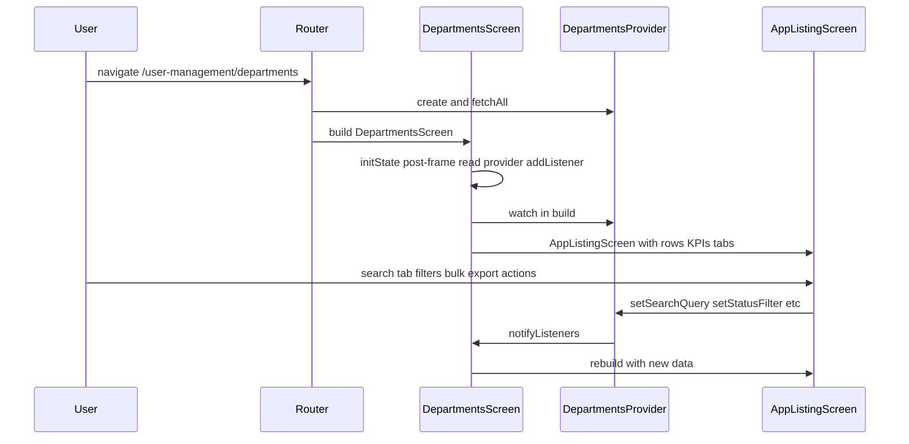

# 1. File Identity

| Attribute | Value |
|-----------|--------|
| **File name** | `departments_screen.dart` |
| **Path** | `lib/features/user_management/departments/ui/departments_screen.dart` |
| **Language / type** | Dart source file defining Flutter UI widgets |
| **Purpose** | Presents the **Departments** admin screen: a responsive listing (table on larger screens, cards on small screens) with status tabs, per-column filters, text search, row selection with **bulk** activate/deactivate/delete/export, pagination, and row-level actions to create, edit, activate/deactivate, and delete departments. **`kpiCards`** are passed to **`AppListingScreen`** but **`showKpis: false`** hides the KPI strip; counts still drive tab badges. Domain state is delegated to `DepartmentsProvider`; this file wires listing props, **`AppConfirmDialog`** for delete confirmation, export snackbars, and **`DepartmentFormDrawer`**. |

**Documentation comment (author intent):**

```14:15:lib/features/user_management/departments/ui/departments_screen.dart
/// Departments listing with KPIs, filters, and CRUD (mock API).
class DepartmentsScreen extends StatefulWidget {
```

**Where it is used in the system**

- Registered in the application router as the widget built for the **`/user-management/departments`** route (nested under the parent **`/user-management`** route group—see snippet below).
- The router wraps the screen in a **`ChangeNotifierProvider<DepartmentsProvider>`** so the screen can `watch` / `read` the provider from `BuildContext`.

Relevant router fragment:

```423:429:lib/core/router/app_router.dart
            GoRoute(
              path: 'departments',
              builder: (context, state) => ChangeNotifierProvider(
                create: (_) => DepartmentsProvider()..fetchAll(),
                child: const DepartmentsScreen(),
              ),
            ),
```

**Redirects that lead users to this screen**

- `/users` redirects to `/user-management/departments`.
- `/user-management` (exact path) redirects to `/user-management/departments`.

**Who / what calls this file**

| Caller | Mechanism |
|--------|-----------|
| **GoRouter** | When the user navigates to `/user-management/departments` (or is redirected there), the route `builder` constructs `const DepartmentsScreen()`. |
| **Flutter framework** | `StatefulWidget` lifecycle: `createState`, `initState`, repeated `build`, `dispose`. |
| **Provider package** | `context.watch<DepartmentsProvider>()` and `context.read<DepartmentsProvider>()` resolve the nearest ancestor `DepartmentsProvider` (supplied by the route). |
| **`DepartmentsProvider`** | Invokes `notifyListeners()` after mutations; the screen’s `build` (via `watch`) and `_onProviderChanged` (via `addListener`) react. |

**Public surface**

- Only **`DepartmentsScreen`** is public. **`_DepartmentsScreenState`** is library-private (leading underscore) and not meant for external use.

---

# 2. Ultra-Simple Explanation (ELI5)

Imagine a **binder** labeled “Departments” at work. **Sticky-note KPIs are not shown on the page** (`showKpis: false`), but tab badges still reflect All / Active / Inactive counts. Each row shows **name and code** together, **description**, **users**, **status**, and **created/updated audit** columns. You can **select rows**, use **bulk** activate/deactivate/delete/export (export is a **snackbar placeholder**), and use **per-column filters**. You can **search**, **tab-filter**, and **paginate**. **Add / edit / toggle / delete** use the drawer and **`AppConfirmDialog`** for delete when allowed.

That binder is what this screen helps you use on the computer. The screen itself does not “remember” the departments in its own variables for the table; it asks a helper (`DepartmentsProvider`) that keeps the list and talks to the data store (here, a mock in-memory API).

---

# 3. System Context

## 3.1 Import graph (what this file depends on)

| Import | Role in this file |
|--------|-------------------|
| `package:flutter/material.dart` | Core widgets: `BuildContext`, `Text`, `Column`, `Row`, `SnackBar`, `ScaffoldMessenger`, etc. |
| `package:google_fonts/google_fonts.dart` | `GoogleFonts.poppins` for cells, cards, export snackbar. |
| `package:lucide_flutter/lucide_flutter.dart` | `LucideIcons` for row actions and KPI card icons. |
| `package:provider/provider.dart` | `watch` / `read`; provider scope from router. |
| `design_system/components/components.dart` | `AppListingScreen`, `TableColumn`, `RowAction`, `AppConfirmDialog`, `AppColumnFilter`, `AppSelectItem`, etc. |
| `design_system/components/display/kpi_metric.dart` | `KpiCard` (passed; strip hidden when `showKpis: false`). |
| `design_system/tokens.dart` | `AppTokens`. |
| `../../shared/audit_cell.dart` | `AuditCell` for **Created By** / **Updated By**. |
| `../data/department_model.dart` | `DepartmentModel`, `DepartmentStatus`. |
| `../state/departments_provider.dart` | `DepartmentsProvider`. |
| `department_form_drawer.dart` | `DepartmentFormDrawer.show`. |

## 3.2 Upstream dependencies (what must exist before this screen works)

1. **Widget tree** must include **`ChangeNotifierProvider<DepartmentsProvider>`** above `DepartmentsScreen`. The app router provides this for the departments route (see §1).
2. **`DepartmentsProvider`** expects **`DepartmentsApi`** from the service locator (`sl<DepartmentsApi>()`) unless tests inject a mock API. Default API is an **in-memory mock** (`DepartmentsApi` in `lib/features/user_management/departments/data/departments_api.dart`).
3. **`DepartmentFormDrawer`** expects the same provider scope for submit actions (defined in its own file; opened with `showGeneralDialog`).

## 3.3 Downstream dependencies (what this file drives)

| Dependency | Interaction |
|-------------|-------------|
| **`AppListingScreen<DepartmentModel>`** | Tabs, search, column filters, checkboxes, bulk bar, optional export, table/cards, pagination, row actions. |
| **`DepartmentFormDrawer`** | Create/edit slide-in. |
| **`DepartmentsProvider`** | Search, status tab, paging, `toggleDepartmentStatus`, `deleteDepartment`, **`bulkActivate` / `bulkDeactivate` / `bulkDelete`**, etc. |
| **`ScaffoldMessenger`** | Errors, guardrails, export placeholder. |
| **`AppConfirmDialog`** | Delete confirmation. |

## 3.4 Lifecycle: when and why this file “runs”

1. **Construction** — User navigates to departments route → router builds `DepartmentsScreen` and provider → `DepartmentsProvider()..fetchAll()` starts loading mock data asynchronously.
2. **`initState`** — Registers a **post-frame callback** so `context.read<DepartmentsProvider>()` is valid (inherits context from the element tree after the first frame). Then attaches **`_onProviderChanged`** as a listener for global error display.
3. **`build`** — Runs on first frame and **every time** `DepartmentsProvider.notifyListeners()` fires and something `watch`es it (this screen uses `context.watch` in `build`). Rebuilds the entire `AppListingScreen` subtree with fresh data.
4. **User interactions** — Search, tabs, column filters, bulk actions, export, row actions → provider → `notifyListeners` → `build` again.
5. **`dispose`** — Removes the provider listener to avoid leaks or callbacks after unmount.



---

# 4. Execution Flow (Step-by-Step)

## 4.1 Class load time

When the Dart VM loads the library, it only registers types (`DepartmentsScreen`, `_DepartmentsScreenState`). No Flutter widgets are built yet.

## 4.2 `DepartmentsScreen` (widget class)

1. **`const DepartmentsScreen({super.key})`** — Const constructor; optional `Key` for framework identity.
2. **`createState()`** — Returns a new **`_DepartmentsScreenState`** instance. Flutter owns the state object’s lifetime.

## 4.3 `_DepartmentsScreenState.initState`

Execution order:

1. **`super.initState()`** — Required Flutter hook.
2. **`WidgetsBinding.instance.addPostFrameCallback((_) { ... })`** — Schedules work **after** the first frame is fully built. Reason: in `initState`, `context` is available but the widget may not yet be fully mounted in all edge cases; more importantly, this defers **`context.read`** until the element is on the tree under the `ChangeNotifierProvider`.
3. **Inside the callback:**
   - **`if (!mounted) return`** — If the user popped the route within one frame, do nothing (avoids using a disposed context).
   - **`_provider = context.read<DepartmentsProvider>()`** — Obtains the provider instance **without** subscribing `build` to changes (read is one-shot).
   - **`_provider!.addListener(_onProviderChanged)`** — Subscribes to **every** `notifyListeners` on that provider.

**Branch:** If `mounted` is false, listener is never attached and `_provider` stays `null`.

## 4.4 `_onProviderChanged` (listener callback)

Invoked synchronously whenever `DepartmentsProvider` calls `notifyListeners()` (including for loading, data changes, and errors).

1. **`final p = _provider`** — Local alias.
2. **Early return if** `p == null` **OR** `!p.hasError` **OR** `!mounted` — Normal case: most notifications have no error; listener exits immediately.
3. **`final message = p.error`** — Captures the error string (may be null in theory if cleared between check and read; handled below).
4. **Second `addPostFrameCallback`** — Defers snackbar to the next frame (common pattern to avoid showing snackbars during build or mid-frame layout).
5. **Inner callback:**
   - Return if `!mounted` or `message == null`.
   - **`ScaffoldMessenger.of(context).showSnackBar(SnackBar(content: Text(message)))`** — Displays the error to the user.
   - **`p.clearError()`** — Clears provider error state and notifies again (listener will run again but hit `!p.hasError` and return).

**Conditional branches:** Two `mounted` checks; `hasError` gate; null `message` guard.

## 4.5 `_DepartmentsScreenState.dispose`

1. **`_provider?.removeListener(_onProviderChanged)`** — If listener was attached, detach it. If `_provider` is still null (dispose before first frame completed), this is a no-op.
2. **`super.dispose()`** — Flutter disposal.

## 4.6 `_confirmDelete(BuildContext context, DepartmentModel row)`

Async function; flow:

1. **`if (!row.canDelete)`** branch:
   - Show snackbar: *Cannot delete a department while users are assigned to it.*
   - **`return`** — No confirmation UI.
2. **`await AppConfirmDialog.show(...)`** — Design-system confirmation:
   - **`title`**: `'Delete Department'`
   - **`message`**: includes **`row.name`**; notes action cannot be undone.
   - **`confirmLabel`**: `'Delete'`, **`variant`**: **`AppConfirmDialogVariant.danger`**
3. **`if (confirmed == true && context.mounted)`** → **`deleteDepartment(row.id)`**.

## 4.6b `_handleExport(BuildContext context, {List<DepartmentModel>? rows})`

Snackbar-only placeholder for toolbar or bulk export (styled with **`GoogleFonts`** / **`AppTokens`**).

## 4.7 `build(BuildContext context)`

Runs whenever the `DepartmentsScreen` element rebuilds (including parent rebuilds) and whenever **`context.watch<DepartmentsProvider>()`** triggers rebuilds on provider notifications.

1. **`final p = context.watch<DepartmentsProvider>()`** — Subscribes this `build` to provider changes.
2. **`final filteredTotal = p.filteredItems.length`** — Count after search + status filter (not raw `_items.length`).
3. **`return AppListingScreen<DepartmentModel>(...)`** — Single child; all UI is delegated.

**Inside `AppListingScreen` (summary):**

- **`showCheckboxes: true`**, **`bulkRowId`**, **`onBulkActivate` / `onBulkDeactivate` / `onBulkDelete`**, **`onBulkExport`**, **`onExport`** (see **`_handleExport`**).
- **`kpiCards`** + **`showKpis: false`** (strip hidden; tab counts unchanged).
- **Tabs**, **`columns`** (six columns with **`AppColumnFilter`** / **`AuditCell`** / **`StatusChip`**), **`mobileCardBuilder`** (**`GoogleFonts`** + **`AppTokens`**), **`rowActions`** (edit; toggle with **`labelBuilder`**/**`iconBuilder`**; delete → **`_confirmDelete`**), **pagination**.

**Loops:** None here; listing iterates rows/columns internally.

---

# 5. Code Breakdown (Deep Dive)

## 5.1 `DepartmentsScreen` extends `StatefulWidget`

| Aspect | Detail |
|--------|--------|
| **Name** | `DepartmentsScreen` |
| **Purpose** | Public entry widget for the departments feature page. Holds no state itself; delegates to `State`. |
| **Parameters** | `const DepartmentsScreen({super.key})` — optional `Key` only (`super.key`). |
| **Return values** | `createState()` returns **`State<DepartmentsScreen>`** implementation `_DepartmentsScreenState`. |
| **Internal logic** | Minimal: constructor passes key to superclass; `createState` instantiates private state class. |
| **Side effects** | None at construction time. |
| **Dependencies** | `StatefulWidget`, `State` from Flutter. |

```13:18:lib/features/user_management/departments/ui/departments_screen.dart
class DepartmentsScreen extends StatefulWidget {
  const DepartmentsScreen({super.key});

  @override
  State<DepartmentsScreen> createState() => _DepartmentsScreenState();
}
```

## 5.2 `_DepartmentsScreenState` extends `State<DepartmentsScreen>`

| Aspect | Detail |
|--------|--------|
| **Name** | `_DepartmentsScreenState` |
| **Purpose** | Holds listener reference, delete/export helpers, and delegates UI to **`AppListingScreen`**. |
| **Type parameter** | `State<DepartmentsScreen>` binds this state to `DepartmentsScreen` only. |

### Field: `DepartmentsProvider? _provider`

| Aspect | Detail |
|--------|--------|
| **Purpose** | Holds the provider instance so **`dispose`** can remove the same listener instance that was added in **`initState`**. |
| **Nullability** | Nullable because it is set **only in a post-frame callback**; before that it is `null`. |
| **Side effects** | None by itself. |

---

### Method: `void initState()`

| Aspect | Detail |
|--------|--------|
| **Purpose** | Schedule provider lookup and error listener attachment after first frame. |
| **Parameters** | None (override of `State.initState`). |
| **Return** | `void` |
| **Step-by-step** | See §4.3. |
| **Side effects** | Registers a one-shot post-frame callback; callback may assign `_provider` and `addListener`. |
| **Dependencies** | `WidgetsBinding.instance`, `mounted`, `context.read` (Provider), `DepartmentsProvider`. |

```25:35:lib/features/user_management/departments/ui/departments_screen.dart
  @override
  void initState() {
    super.initState();
    WidgetsBinding.instance.addPostFrameCallback((_) {
      if (!mounted) {
        return;
      }
      _provider = context.read<DepartmentsProvider>();
      _provider!.addListener(_onProviderChanged);
    });
  }
```

---

### Method: `void _onProviderChanged()`

| Aspect | Detail |
|--------|--------|
| **Purpose** | When the provider signals an **error** (`hasError`), show a **SnackBar** once and clear the error. Ignores notifications for loading/success-only updates. |
| **Parameters** | None (ChangeNotifier listener signature). |
| **Return** | `void` |
| **Step-by-step** | See §4.4. |
| **Side effects** | May enqueue post-frame callback; may show `SnackBar`; calls `clearError()` → additional `notifyListeners`. |
| **Dependencies** | `DepartmentsProvider.hasError`, `.error`, `.clearError()`, `ScaffoldMessenger`, `mounted`. |

```37:52:lib/features/user_management/departments/ui/departments_screen.dart
  void _onProviderChanged() {
    final p = _provider;
    if (p == null || !p.hasError || !mounted) {
      return;
    }
    final message = p.error;
    WidgetsBinding.instance.addPostFrameCallback((_) {
      if (!mounted || message == null) {
        return;
      }
      ScaffoldMessenger.of(context).showSnackBar(
        SnackBar(content: Text(message)),
      );
      p.clearError();
    });
  }
```

---

### Method: `void dispose()`

| Aspect | Detail |
|--------|--------|
| **Purpose** | Tear down listener to prevent memory leaks and use-after-dispose. |
| **Parameters** | None. |
| **Return** | `void` |
| **Side effects** | `removeListener` on provider if set. |
| **Dependencies** | `_provider`, `_onProviderChanged`, `super.dispose()`. |

```54:58:lib/features/user_management/departments/ui/departments_screen.dart
  @override
  void dispose() {
    _provider?.removeListener(_onProviderChanged);
    super.dispose();
  }
```

---

### Method: `Future<void> _confirmDelete(BuildContext context, DepartmentModel row)`

| Aspect | Detail |
|--------|--------|
| **Purpose** | Enforce **canDelete**; else **`AppConfirmDialog.show`**; then **`deleteDepartment`**. |
| **Dependencies** | **`DepartmentModel.canDelete`**, **`AppConfirmDialog`**, **`Provider`**, **`DepartmentsProvider`**. |

```60:81:lib/features/user_management/departments/ui/departments_screen.dart
  Future<void> _confirmDelete(BuildContext context, DepartmentModel row) async {
    if (!row.canDelete) {
      ScaffoldMessenger.of(context).showSnackBar(
        const SnackBar(
          content: Text(
            'Cannot delete a department while users are assigned to it.',
          ),
        ),
      );
      return;
    }
    final confirmed = await AppConfirmDialog.show(
      context: context,
      title: 'Delete Department',
      message: 'Delete "${row.name}"? This cannot be undone.',
      confirmLabel: 'Delete',
      variant: AppConfirmDialogVariant.danger,
    );
    if (confirmed == true && context.mounted) {
      await context.read<DepartmentsProvider>().deleteDepartment(row.id);
    }
  }
```

---

### Method: `void _handleExport(BuildContext context, {List<DepartmentModel>? rows})`

| **Purpose** | Placeholder export (snackbar only). |
| **Dependencies** | **`GoogleFonts.poppins`**, **`AppTokens`**, **`ScaffoldMessenger`**. |

```83:99:lib/features/user_management/departments/ui/departments_screen.dart
  void _handleExport(BuildContext context, {List<DepartmentModel>? rows}) {
    ScaffoldMessenger.of(context).showSnackBar(
      SnackBar(
        content: Text(
          rows != null
              ? 'Exporting ${rows.length} records...'
              : 'Exporting all records...',
          style: GoogleFonts.poppins(
            fontSize: AppTokens.textBase,
            color: AppTokens.white,
          ),
        ),
        backgroundColor: AppTokens.primary800,
        duration: const Duration(seconds: 2),
      ),
    );
  }
```

---

### Method: `Widget build(BuildContext context)`

| Aspect | Detail |
|--------|--------|
| **Purpose** | Compose the departments page via **`AppListingScreen<DepartmentModel>`** (checkboxes, bulk actions, column filters, audit columns, tabs). |
| **Parameters** | **`BuildContext context`**. |
| **Return** | **`Widget`**. |
| **Side effects** | None directly in **`build`**; callbacks mutate the provider. |
| **Dependencies** | **`context.watch`**, **`AppListingScreen`**, **`GoogleFonts`**, **`AppColumnFilter`**, **`AuditCell`**, **`KpiCard`**, **`TabConfig`**, **`RowAction`**, **`DepartmentFormDrawer`**, **`DepartmentsProvider`** (including bulk APIs). |

```101:348:lib/features/user_management/departments/ui/departments_screen.dart
  @override
  Widget build(BuildContext context) {
    final p = context.watch<DepartmentsProvider>();
    final filteredTotal = p.filteredItems.length;

    return AppListingScreen<DepartmentModel>(
      title: 'Departments',
      subtitle: 'Organize users by department',
      primaryActionLabel: '+ Add Department',
      onPrimaryAction: () => DepartmentFormDrawer.show(context),
      showCheckboxes: true,
      bulkRowId: (r) => r.id,
      onExport: () => _handleExport(context),
      onBulkActivate: (ids) async => p.bulkActivate(ids.cast<String>()),
      onBulkDeactivate: (ids) async => p.bulkDeactivate(ids.cast<String>()),
      onBulkDelete: (ids) async => p.bulkDelete(ids.cast<String>()),
      onBulkExport: (rows) async => _handleExport(
            context,
            rows: rows.cast<DepartmentModel>().toList(),
          ),
      kpiCards: [
        KpiCard(
          label: 'Total Departments',
          value: p.totalCount.toString(),
          icon: LucideIcons.building2,
          iconColor: AppTokens.kpiBlue,
        ),
        KpiCard(
          label: 'Active',
          value: p.activeCount.toString(),
          icon: LucideIcons.checkCircle,
          iconColor: AppTokens.kpiGreen,
        ),
        KpiCard(
          label: 'Inactive',
          value: p.inactiveCount.toString(),
          icon: LucideIcons.xCircle,
          iconColor: AppTokens.kpiOrange,
        ),
      ],
      showKpis: false,
      tabs: [
        TabConfig(label: 'All', count: p.tabAllCount),
        TabConfig(label: 'Active', count: p.activeCount),
        TabConfig(label: 'Inactive', count: p.inactiveCount),
      ],
      initialTabIndex: p.statusTabIndex,
      onTabChanged: (i) {
        p.setStatusFilter(
          i == 0
              ? null
              : (i == 1
                  ? DepartmentStatus.active
                  : DepartmentStatus.inactive),
        );
      },
      columns: [
        TableColumn<DepartmentModel>(
          key: 'name',
          label: 'Department Name',
          width: 200,
          sortable: false,
          filter: const AppColumnFilter(type: AppColumnFilterType.text),
          filterTextValue: (r) => '${r.name} ${r.code}',
          cellBuilder: (r) => Column(
            crossAxisAlignment: CrossAxisAlignment.start,
            mainAxisAlignment: MainAxisAlignment.center,
            children: [
              Text(
                r.name,
                style: GoogleFonts.poppins(
                  fontSize: AppTokens.tableCellSize,
                  fontWeight: FontWeight.w500,
                  color: AppTokens.textPrimary,
                ),
                maxLines: 1,
                overflow: TextOverflow.ellipsis,
              ),
              Text(
                r.code,
                style: GoogleFonts.poppins(
                  fontSize: AppTokens.captionSize,
                  fontWeight: FontWeight.w400,
                  color: AppTokens.textMuted,
                ),
              ),
            ],
          ),
        ),
        TableColumn<DepartmentModel>(
          key: 'description',
          label: 'Description',
          sortable: false,
          filter: const AppColumnFilter(type: AppColumnFilterType.text),
          filterTextValue: (r) => r.description ?? '',
          cellBuilder: (r) => Text(
            r.description ?? '—',
            style: GoogleFonts.poppins(
              fontSize: AppTokens.tableCellSize,
              color: AppTokens.textSecondary,
            ),
            maxLines: 1,
            overflow: TextOverflow.ellipsis,
          ),
        ),
        TableColumn<DepartmentModel>(
          key: 'users',
          label: 'Users',
          width: 80,
          sortable: true,
          sortValue: (r) => r.usersCount,
          cellBuilder: (r) => Center(
            child: Text(
              r.usersCount.toString(),
              style: GoogleFonts.poppins(
                fontSize: AppTokens.tableCellSize,
                fontWeight: FontWeight.w500,
                color: AppTokens.textPrimary,
              ),
              textAlign: TextAlign.center,
            ),
          ),
        ),
        TableColumn<DepartmentModel>(
          key: 'status',
          label: 'Status',
          width: 90,
          sortable: false,
          filter: const AppColumnFilter(
            type: AppColumnFilterType.select,
            options: [
              AppSelectItem<String>(value: 'active', label: 'Active'),
              AppSelectItem<String>(value: 'inactive', label: 'Inactive'),
            ],
          ),
          filterSelectValue: (r) => r.status.name,
          cellBuilder: (r) => Center(
            child: StatusChip(status: r.status.name),
          ),
        ),
        TableColumn<DepartmentModel>(
          key: 'createdBy',
          label: 'Created By',
          width: 160,
          sortable: true,
          sortValue: (r) => r.createdAt.millisecondsSinceEpoch,
          cellBuilder: (r) => AuditCell(
            name: r.createdBy,
            date: r.createdAt,
          ),
        ),
        TableColumn<DepartmentModel>(
          key: 'updatedBy',
          label: 'Updated By',
          width: 160,
          sortable: true,
          sortValue: (r) => r.updatedAt.millisecondsSinceEpoch,
          cellBuilder: (r) => AuditCell(
            name: r.updatedBy,
            date: r.updatedAt,
          ),
        ),
      ],
      rows: p.pagedRows,
      mobileCardBuilder: (r) {
        return Column(
          crossAxisAlignment: CrossAxisAlignment.start,
          children: [
            Text(
              r.name,
              style: GoogleFonts.poppins(
                fontSize: AppTokens.tableCellSize,
                fontWeight: FontWeight.w500,
                color: AppTokens.textPrimary,
              ),
              overflow: TextOverflow.ellipsis,
            ),
            SizedBox(height: AppTokens.space1),
            Text(
              r.code,
              style: GoogleFonts.poppins(
                fontSize: AppTokens.captionSize,
                fontWeight: FontWeight.w400,
                color: AppTokens.textMuted,
              ),
            ),
            SizedBox(height: AppTokens.space2),
            Row(
              children: [
                StatusChip(status: r.status.name),
                SizedBox(width: AppTokens.space3),
                Text(
                  '${r.usersCount} users',
                  style: GoogleFonts.poppins(
                    fontSize: AppTokens.captionSize,
                    fontWeight: FontWeight.w400,
                    color: AppTokens.textSecondary,
                  ),
                ),
              ],
            ),
          ],
        );
      },
      isLoading: p.isLoading,
      emptyMessage: 'No departments match your filters',
      onSearch: p.setSearchQuery,
      searchHint: 'Search by name, code, or description…',
      rowActions: [
        RowAction<DepartmentModel>(
          key: 'edit',
          label: 'Edit',
          icon: const Icon(LucideIcons.pencil),
          onTap: (row) => DepartmentFormDrawer.show(context, existing: row),
        ),
        RowAction<DepartmentModel>(
          key: 'toggle',
          label: 'Activate',
          icon: const Icon(LucideIcons.checkCircle),
          labelBuilder: (row) => row.status == DepartmentStatus.active
              ? 'Deactivate'
              : 'Activate',
          iconBuilder: (row) => Icon(
            row.status == DepartmentStatus.active
                ? LucideIcons.xCircle
                : LucideIcons.checkCircle,
          ),
          onTap: (row) async {
            await context.read<DepartmentsProvider>().toggleDepartmentStatus(
                  row.id,
                );
          },
        ),
        RowAction<DepartmentModel>(
          key: 'delete',
          label: 'Delete',
          icon: const Icon(LucideIcons.trash2),
          isDanger: true,
          onTap: (row) => _confirmDelete(context, row),
        ),
      ],
      totalCount: filteredTotal,
      currentPage: p.effectiveCurrentPage,
      pageSize: p.pageSize,
      onPageChanged: p.setPage,
      onPageSizeChanged: p.setPageSize,
    );
  }

```

**Column builders**

| Column key | Behavior |
|------------|----------|
| `name` | Stacked name + code; **text** `AppColumnFilter` on name and code; width 200; not sortable. |
| `description` | Ellipsis; text filter; not sortable. |
| `users` | Centered count; width 80; sortable by **`usersCount`**. |
| `status` | **Select** filter (active/inactive); **`StatusChip`**; width 90; not sortable. |
| `createdBy` | **`AuditCell`**; sortable by **`createdAt`**. |
| `updatedBy` | **`AuditCell`**; sortable by **`updatedAt`**. |

**`mobileCardBuilder`**

- **`GoogleFonts.poppins`** + **`AppTokens`** (no **`Theme.textTheme`** for primary text).

**`rowActions`**

| key | label | onTap |
|-----|-------|--------|
| `edit` | Edit | **`DepartmentFormDrawer.show(context, existing: row)`** |
| `toggle` | **Activate** / **Deactivate** via **`labelBuilder`** / **`iconBuilder`** | **`toggleDepartmentStatus(row.id)`** |
| `delete` | Delete | **`_confirmDelete(context, row)`** |

---

# 6. State & Data Flow

## 6.1 What data enters this file

| Source | Data |
|--------|------|
| **`DepartmentsProvider`** (via `watch`) | Full public state: `items` backing store effects through getters like `filteredItems`, `pagedRows`, counts, `isLoading`, `statusTabIndex`, pagination fields, etc. |
| **`BuildContext`** | Theme, media/orientation (indirectly via listing), `Provider` scope, `ScaffoldMessenger`. |
| **Row callbacks** | Each `DepartmentModel` instance `r` / `row` for the row under interaction. |
| **Dialog / confirm** | **`AppConfirmDialog.show`** result (`true` = user confirmed delete). |

## 6.2 How data is transformed in this file

| Transformation | Where |
|----------------|--------|
| **Filtered total for pagination** | `filteredTotal = p.filteredItems.length` — pagination total reflects **search + status tab**, not necessarily `p.totalCount`. |
| **Tab index ↔ filter** | `onTabChanged` maps integer tab index to `DepartmentStatus?` for `setStatusFilter`. |
| **Display strings** | `'${p.totalCount}'` etc.; description `?? '—'`; user count in mobile card as `'${r.usersCount} users'`. |
| **Status for chip** | `r.status.name` (string form of enum: `"active"` / `"inactive"`). |

## 6.3 Where data is stored

| Data | Storage location |
|------|------------------|
| Department list, search query, status filter, page index/size | **`DepartmentsProvider`** private fields (`_items`, `_searchQuery`, …) — **not** in the screen state. |
| Provider reference + listener | **`_DepartmentsScreenState._provider`** and Flutter’s listener list on the `ChangeNotifier`. |
| Form field text / validation | **`DepartmentFormDrawer`** internal state (not this file). |

## 6.4 What leaves this file (outputs)

| Output | Mechanism |
|--------|-----------|
| **User-visible UI** | `AppListingScreen` subtree. |
| **Provider mutations** | `setStatusFilter`, `setSearchQuery`, `setPage`, `setPageSize`, `toggleDepartmentStatus`, `deleteDepartment`, bulk activate/deactivate/delete. |
| **Snackbars** | Errors, delete guardrail, export placeholder. |
| **Navigation / overlays** | **`DepartmentFormDrawer.show`**, **`AppConfirmDialog.show`**. |

---

# 7. Business Logic & Rules

## 7.1 Explicit rules implemented in this file

1. **Delete guard (client)** — If **`!row.canDelete`**, show snackbar and **do not** open **`AppConfirmDialog`**. `canDelete` is **`usersCount == 0`** on the model (see `department_model.dart`).
2. **Delete confirm (user)** — When `canDelete`, user must confirm via **`AppConfirmDialog`** or cancel/dismiss.
3. **Delete execution** — Only if **`confirmed == true`** and **`context.mounted`** after **`await`**.
4. **Tab filter mapping** — Exactly three tabs: All (clears status filter), Active, Inactive. Assumes `AppListingScreen` never calls `onTabChanged` with an index outside `0..2` for this configuration (listing clamps internal selection if needed).
5. **KPI strip** — **`kpiCards`** are configured but **`showKpis: false`** hides the KPI row; tab badge counts still reflect **`tabAllCount` / `activeCount` / `inactiveCount`**. Table uses **`p.pagedRows`** from **`filteredItems`**.
6. **Column filters** — Per-column **`AppColumnFilter`** (and listing column picker) subset rows **client-side** on the current dataset; pagination totals follow listing rules.
7. **Bulk selection** — **`bulkRowId`** maps rows to **`String`** ids for **`onBulk*`** callbacks.
8. **Empty state copy** — `'No departments match your filters'` when filtered/page result is empty (driven by listing + `rows`).

## 7.2 Hidden assumptions

1. **`DepartmentsProvider` is an ancestor** of `DepartmentsScreen` in the widget tree for both `read` and `watch`.
2. **Three tabs** in fixed order match **`statusTabIndex`** logic in provider (`0` = all, `1` = active, `2` = inactive). Renaming/reordering tabs without updating `onTabChanged` mapping would break filtering.
3. **`ScaffoldMessenger`** exists above this screen (typically from `MaterialApp` / shell `Scaffold`); otherwise snackbars may not show or may throw in debug.
4. **`initialTabIndex`** is driven by provider each build; **`AppListingScreen`** updates internal tab when the prop changes:

```448:451:lib/design_system/components/listing/app_listing_screen.dart
    if (oldWidget.initialTabIndex != widget.initialTabIndex) {
      _selectedTab = _clampTab(widget.initialTabIndex);
    }
```

## 7.3 Default values and fallbacks

| Item | Value |
|------|--------|
| `description` null in table | Displays **`'—'`** (em dash). |
| `showCheckboxes` | **`true`** with **`bulkRowId`** and bulk callbacks. |
| **`AppConfirmDialog` dismiss** | `confirmed != true` → no delete call. |

---

# 8. External Interactions

## 8.1 APIs and services

This file **does not** call HTTP or platform channels directly. All persistence goes through **`DepartmentsProvider`**, which uses **`DepartmentsApi`**.

- **`DepartmentsApi`** is documented as an **in-memory mock** (constructor seeds departments; `fetchAll`, `create`, `update`, `toggleStatus`, `delete` mutate a list).
- **`delete`** in API also throws if `usersCount > 0` even if UI slipped (defense in depth).

## 8.2 Libraries

| Library | Usage |
|---------|--------|
| **flutter/material.dart** | Core Material widgets; snackbars. |
| **google_fonts** | Poppins for cells/cards/export. |
| **provider** | `watch` / `read`. |
| **lucide_flutter** | Icons. |

## 8.3 Request/response structure (indirect)

The screen passes **`row.id`** (String) to **`deleteDepartment`**. Provider methods refresh **`_items`** from **`_api.fetchAll()`** after mutations. The screen never deserializes JSON.

## 8.4 Error handling behavior

1. **`BaseProvider.runAsync`** (inherited by `DepartmentsProvider`) wraps async work: sets loading, clears error, on exception **`setError(e.toString())`**, then clears loading.
2. **This screen’s `_onProviderChanged`** listens for **`hasError`** and surfaces **`error`** via SnackBar, then **`clearError()`**.

```28:38:lib/core/providers/base_provider.dart
  Future<void> runAsync(Future<void> Function() fn) async {
    setLoading(true);
    clearError();
    try {
      await fn();
    } catch (e) {
      setError(e.toString());
    } finally {
      setLoading(false);
    }
  }
```

**Not handled in this file:** Parsing error strings for user-friendly messages; retry UI; logging.

---

# 9. Edge Cases & Failure Points

| Scenario | Behavior / risk |
|----------|------------------|
| **Route popped before post-frame** | `_provider` may stay `null`; listener never attached; **no memory leak**, but **no error snackbars** from `_onProviderChanged` (provider still works for `watch` in `build` if widget somehow rebuilt—unlikely if disposed). |
| **Provider error fires before listener attached** | If `fetchAll` failed in the same window before callback runs, user might **miss** that error via listener; **`build` still runs** and could show loading/error depending on listing. Worth testing. |
| **`context` after async gap in `_confirmDelete`** | **`context.mounted`** check before `read` prevents use after dispose. **Snackbars** in the `!canDelete` branch use the passed `context` synchronously—safe if caller used a valid context. |
| **Toggle action `onTap`** | `async` closure; errors go to provider; if context unmounted, listing may still complete—generally OK. |
| **`DepartmentFormDrawer.show`** | Uses `showGeneralDialog`; if no `ScaffoldMessenger` ancestor, snackbars inside drawer could fail (drawer’s own concern). |
| **Tab index mismatch** | If `tabs` length ever diverges from mapping in `onTabChanged`, wrong filter could apply (currently consistent). |
| **KPI vs table mismatch** | With **`showKpis: false`**, the KPI strip is hidden; **tab badge** counts can still disagree with a heavily filtered/paginated table (**All** reflects unfiltered totals in the provider while the table shows **`filteredItems`**). If **`showKpis`** is turned on later, the same “KPI total vs filtered rows” product question applies. |
| **Concurrent deletes** | Double-tap delete: **`AppConfirmDialog`** prevents repeat until closed; after confirm, async delete—possible race if two dialogs (listing should prevent duplicate menus depending on implementation). |

---

# 10. Performance Considerations

1. **`context.watch<DepartmentsProvider>()` in `build`** — Any `notifyListeners` rebuilds **this entire screen** and reconstructs the **`AppListingScreen`** configuration object and all closures (`onTabChanged`, `mobileCardBuilder`, column builders, row actions). For large teams this is usually fine; hotspot would be **`AppListingScreen`** internals, not this thin file.
2. **`filteredItems` / `pagedRows`** — Recomputed on each read in provider (during build). For very large lists, consider memoizing in provider (outside this file).
3. **Icons** — `const Icon(LucideIcons...)` where used reduces rebuild cost slightly.
4. **Post-frame callbacks** — Negligible overhead; two-step error display avoids layout issues.

---

# 11. Security Considerations

1. **No authentication or authorization** in this file—any user who can reach the route can trigger UI actions. Real apps should guard routes at router or shell level.
2. **Delete confirmation** mitigates accidental deletion; **server-side** validation would still be required for a real API (`DepartmentsApi.delete` already enforces non-zero users).
3. **Error strings** — `e.toString()` from exceptions may leak implementation details in SnackBars (provider/base layer concern).
4. **Dialog content** — Delete confirmation message includes **`row.name`** (plain **`Text`** in **`AppConfirmDialog`**).

---

# 12. How to Modify This File

## 12.1 Relatively safe edits

- Title, subtitle, `primaryActionLabel`, `searchHint`, `emptyMessage`.
- KPI labels (not logic).
- Column labels, widths, `cellBuilder` presentation (e.g. add icons, badges).
- **`mobileCardBuilder`** layout and typography tokens.
- Row action labels/icons (keep keys stable if analytics/tests depend on them).
- Add **non-destructive** row actions (new `RowAction`s) calling new provider methods.

## 12.2 Dangerous or fragile areas

- **`onTabChanged` index mapping** — Must stay synchronized with tab order and `DepartmentsProvider.statusTabIndex`.
- **`initState` / `dispose` listener pairing** — Mismatch causes leaks or crashes.
- **Changing `DepartmentModel` type** on `AppListingScreen` generic — must match columns and actions.
- **Removing `context.mounted` check** after async gaps — can throw or use disposed `InheritedWidget`s.
- **Replacing `watch` with `read` in `build`** — UI would stop updating on provider changes.

## 12.3 What changes can break the system

- Embedding **`DepartmentsScreen`** without **`ChangeNotifierProvider<DepartmentsProvider>`** → runtime failure on `watch`/`read`.
- **Renaming provider class** without updating imports/usages.
- **Altering `RowAction` / `AppListingScreen` API** in design system without updating this call site.

---

# 13. Example Scenarios

## 13.1 User taps “+ Add Department”

1. **`onPrimaryAction`** fires → **`DepartmentFormDrawer.show(context)`** with `existing: null`.
2. User fills form and saves → provider **`createDepartment`** → **`fetchAll`** → **`notifyListeners`**.
3. **`build`** runs → new row appears in table (subject to filters/pagination).

## 13.2 User edits “Lab” department

1. Row overflow → **Edit** → **`DepartmentFormDrawer.show(context, existing: row)`** with that `DepartmentModel`.
2. Save → **`updateDepartment`** in provider → list refresh.

## 13.3 User toggles status

1. Row menu shows **Activate** or **Deactivate** (dynamic **`labelBuilder`** / **`iconBuilder`**) → **`toggleDepartmentStatus(row.id)`** → API flips enum → refresh.
2. Status chip and tab badge counts update on rebuild.

## 13.4 User searches for “adm”

1. Listing calls **`onSearch`** with each change → **`p.setSearchQuery`** resets page to 1 and filters by substring match (provider) on name, code, description.
2. **`filteredTotal`** shrinks; pagination clamps via **`effectiveCurrentPage`**.

## 13.5 User deletes empty department

1. Row has **`usersCount == 0`** → **`canDelete` true**.
2. **`AppConfirmDialog`** → user confirms → **`confirmed == true`** and **`context.mounted`** → **`deleteDepartment(id)`** → row removed from mock list.

## 13.6 User tries to delete “Admin” with users assigned

1. **`canDelete` false** → snackbar: *Cannot delete a department while users are assigned to it.* — **no dialog**.

## 13.7 API throws (e.g. unknown id)

1. **`runAsync`** catches → **`setError('Bad state: ...')`** (example).
2. **`_onProviderChanged`** shows SnackBar with that string → **`clearError()`**.

---

# 14. Glossary

| Term | Meaning |
|------|---------|
| **StatefulWidget** | Flutter widget that has mutable **State** separated from immutable configuration widget. |
| **State&lt;T&gt;** | Object holding mutable fields and lifecycle for `StatefulWidget` of type `T`. |
| **BuildContext** | Handle to a widget’s location in the tree; used to find themes, inherited widgets, `Navigator`, `ScaffoldMessenger`. |
| **ChangeNotifier** | Flutter class that maintains a list of listeners and calls them on **`notifyListeners()`**. |
| **DepartmentsProvider** | Feature `ChangeNotifier` extending **`BaseProvider`**; holds department list, filters, pagination; performs CRUD via API. |
| **Provider / `context.watch`** | Subscribes `build` to `ChangeNotifier` updates. |
| **`context.read`** | One-time lookup; does not subscribe (used for callbacks and `initState`). |
| **Post-frame callback** | Work scheduled to run after the current frame is painted (`WidgetsBinding.instance.addPostFrameCallback`). |
| **`mounted`** | Whether the `State` is still in the tree; `false` after `dispose`. |
| **AppListingScreen** | Design-system reusable page: optional KPI strip (**`showKpis`**), tabs, search, table/cards, pagination, row actions, bulk selection. |
| **AppConfirmDialog** | Design-system confirmation modal (**`AppConfirmDialog.show`**) with variants such as **`AppConfirmDialogVariant.danger`** for destructive actions. |
| **AppColumnFilter** | Declarative per-column filter config consumed by the listing (text, select, etc.). |
| **AuditCell** | Shared widget for created/updated metadata columns (avatar, name, relative time). |
| **TableColumn** | Descriptor for a data column: key, label, width, `cellBuilder`, sort flags. |
| **RowAction** | Overflow menu entry: key, label, icon, `onTap(row)`, optional danger styling. |
| **TabConfig** | Tab label + optional badge count for listing tabs. |
| **KpiCard** | Small summary tile (from `kpi_metric.dart`) showing label + value string. |
| **DepartmentModel** | Immutable data class for one department row. |
| **DepartmentStatus** | Enum: **`active`**, **`inactive`**. |
| **`canDelete`** | Getter: true only if **`usersCount == 0`**. |
| **SnackBar** | Transient message at bottom of screen via `ScaffoldMessenger`. |
| **AppTokens** | Design tokens (spacing, colors) for consistent UI. |
| **StatusChip** | Design-system chip showing status string. |
| **Mock API** | `DepartmentsApi` using in-memory lists instead of network I/O. |

---

# 15. Final Mental Model

Think of **`departments_screen.dart`** as a **control panel faceplate**: it does not store the machinery behind the wall; it **plugs wires** from one standard gauge template (**`AppListingScreen`**) into the department machine (**`DepartmentsProvider`**). When a knob is turned (search, tab, page) or a button pressed (add, edit, toggle, delete), the faceplate forwards the signal to the provider; when the machine faults, a small light (**SnackBar**) blinks once thanks to the listener, then clears the fault flag. The faceplate’s only “memory” is knowing which machine instance to unplug when the room is demolished (**`dispose`**).

---

*Generated documentation for `lib/features/user_management/departments/ui/departments_screen.dart` (~350 lines). Line numbers cite the repo revision synced when this doc was last updated (May 2026).*
